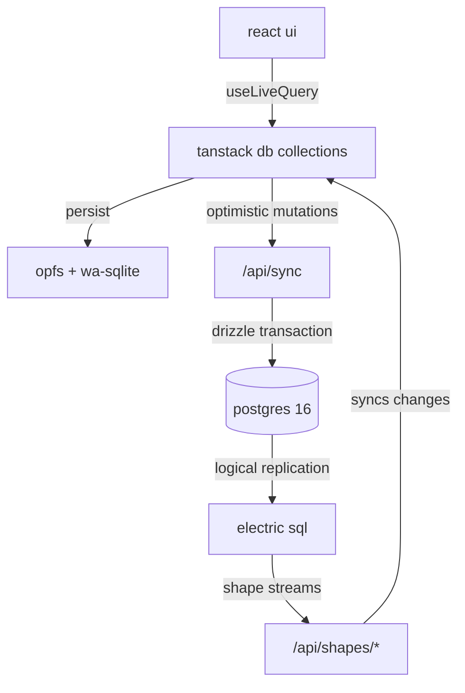

# habits

a local-first habit tracker. data lives in the browser via opfs + wa-sqlite, syncs with postgres via electric sql. passkey-only auth.

## stack

| layer      | choice                                        |
| ---------- | --------------------------------------------- |
| runtime    | node 25 + pnpm                                |
| framework  | react router v7 (ssr)                         |
| ui         | base ui + tailwind css v4                     |
| data/sync  | tanstack db + electric sql + opfs (wa-sqlite) |
| server db  | postgres 16                                   |
| orm        | drizzle orm                                   |
| auth       | better-auth + passkey                         |
| validation | zod                                           |
| tooling    | biome + husky + vitest                        |

## prerequisites

- [node 25](https://nodejs.org)
- [pnpm](https://pnpm.io)
- [docker](https://docker.com)

## local dev

```bash
cp .env.example .env
docker compose up -d
pnpm install
pnpm db:push
pnpm dev
```

app runs at `http://localhost:5173`

## commands

| command            | description                      |
| ------------------ | -------------------------------- |
| `pnpm dev`         | start dev server                 |
| `pnpm build`       | production build                 |
| `pnpm start`       | serve production build           |
| `pnpm lint`        | check with biome                 |
| `pnpm format`      | format with biome                |
| `pnpm typecheck`   | run typescript checks            |
| `pnpm test`        | run tests                        |
| `pnpm test:watch`  | run tests in watch mode          |
| `pnpm db:generate` | generate drizzle migrations      |
| `pnpm db:migrate`  | run drizzle migrations           |
| `pnpm db:push`     | push schema to database          |
| `pnpm db:reset`    | nuke db volume and repush schema |
| `pnpm db:studio`   | open drizzle studio              |
| `pnpm db:auth`     | regenerate better-auth schema    |

## architecture



- **reads**: electric streams postgres changes -> shape proxy endpoints -> tanstack db collections -> opfs sqlite cache
- **writes**: tanstack db optimistic mutation -> /api/sync -> drizzle transaction -> postgres -> electric streams back

## deployment

configured for railway via `railway.toml` and `Dockerfile`.
